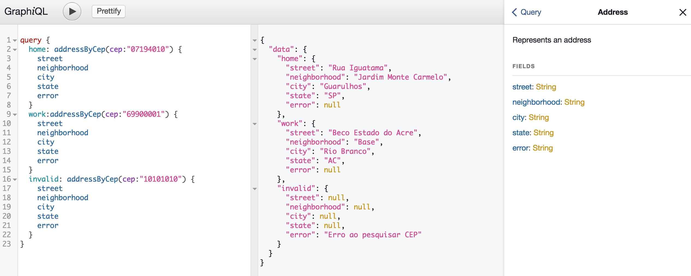

# GraphQL CEP 

Query any CEP (Brasil) using GraphQL

Test it here: https://graphql-cep-liimjftpnr.now.sh



## Command

#### Setup
```bash
npm install
```
#### Develop
```bash
npm run watch
```

#### Production
```bash
# first compile the code
npm run build

# run graphql compiled server
npm start
```

### Flow
```bash
npm run flow
```

Or
```bash
flow
```

### Schema
Take a look on the [Schema](https://github.com/sibelius/graphql-cep/blob/master/data/schema.graphql)

Based on [graphql-dataloader-boilerplate](https://github.com/sibelius/graphql-dataloader-boilerplate)
